  

Desenvolvedor Full-Stack & Entusiasta de IA do Brasil 🇧🇷

**Sobre mim**

- 🔭 Explorando agentes de IA, MCP e automação de workflows
- 🌱 Aprendendo arquitetura de agentes, LLMs e sistemas distribuídos
- ⚡ Fato: Comecei do zero, estou construindo meu caminho um commit por vez

**Tech Stack**

<code></code>
<code></code>
<code></code>
<code></code>
<code></code>
<code></code>
<code></code>

 
 

|  |  |
|---|---|

 

  
  
  
    
  

