<div align="center">
  
</div>

```yaml
name: Gabriel Henrique
alias: Losthc
located_in: Brazil
job: Desenvolvedor Full-Stack & Entusiasta de IA

current_focus:
  - Agentes inteligentes com Claude + MCP
  - Automação de workflows
  - Open-source

tech_stack:
  frontend: [TypeScript, React, Next.js, HTML, CSS]
  backend: [Node.js, Python]
  ai_tools: [Claude, MCP, LangChain]
  tools: [Git, VS Code, Docker]

goal: "Construir ferramentas que amplificam o potencial humano com IA"
```

<br>

<table align="center">
  <tr>
    <td>
      
    </td>
    <td>
      
    </td>
  </tr>
</table>

<br>

<!-- GitHub Trophies -->
<div align="center">
  
</div>

<br>

<!-- Activity Graph -->
<div align="center">
  
</div>

<br>

---

### ⚡ Tech Stack

<div align="center">
  
  
  
  
  
  
  
  
  
</div>

---

### 📌 Sobre mim

```diff
+ 🔭 Atualmente explorando: Agentes de IA, MCP, automação
+ 🌱 Aprendendo: Arquitetura de agentes, LLMs, sistemas distribuídos
+ 👯 Buscando colaborar em: Projetos open-source de IA
+ 💡 Interesses: Inteligência Artificial · Automação · Open Source · MCP
+ ⚡ Fato: Comecei do zero e estou construindo meu caminho um commit por vez
```

---

### 📊 GitHub Analytics

<div align="center">
  
</div>

---

### 📫 Onde me encontrar

<div align="center">
  <a href="https://github.com/Losthc">
    
  </a>

</div>

<br>

<div align="center">
  
</div>

<div align="center">
  <sub>⚡ "Code is poetry in motion"</sub>
</div>

